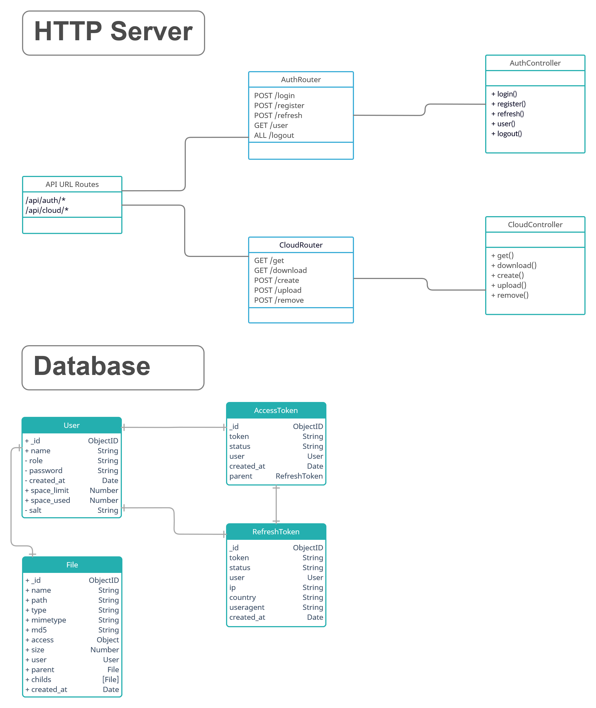

# SimpleCloud Backend

Main application script is located in `src/index.js` file  
For HTTP Server, we are using `express` module

## Install

```shell
~#  npm i
~#  node src/index.js

    DB Connected to mongodb://51.83.187.184:27017
    HTTP Server started on http://localhost:3001
```


## Diagram



# API

For every request, API returns JSON object with fields:
- `time` – the time it took the server to process the request
- `response` – the field in which the server returns the request response
- `error` – the object in which the error information is returned. 

> The `response` and `error` fields cannot be in the same response.

## Successfull response example
```javascript
/*
    HTTP/3 200 OK
    Date: Thu, 24 Mar 2022 15:00:00 GMT
    Status: 200 OK
    Connection: close
    Content-Type: application/json
*/

{
    time: Float,
    response: Object || Array || String || Number
}
```

## Response example, if error occurred
- `error_code` – error code, according to [HTTP error codes](https://en.wikipedia.org/wiki/List_of_HTTP_status_codes)
- `error_description` - error description, according to [HTTP error codes](https://en.wikipedia.org/wiki/List_of_HTTP_status_codes) 
- `error_message` *(optional)* - Additional information about error.
```javascript
/*
    HTTP/3 {error_code} {error_description}
    Date: Thu, 24 Mar 2022 15:00:00 GMT
    Status: {error_code} {error_description}
    Connection: close
    Content-Type: application/json
*/

{
    time: Float,
    error: {
        error_code: Number,
        error_description: String,
        error_message: String?
    }
}
```

# Authentication

For authentication, we are using [**OAuth 2.0**](https://oauth.net/2/) - *industry-standard protocol for authorization*  
When logging in via `/api/auth/login`, the user receives `access_token` and `refresh_token`.  

All API requests are made using `access_token` in `Authorization` **header**.

### Request example
```javascript
import axios from 'axios'

axios({
    method: 'GET',
    url: '/api/auth/user',
    withCredentials: true,
    headers: {
        Authorization: `Bearer ${access_token}`
    }
})
```

`access_token` has a lifetime of **1 hour**. After expiration, it should be updated using `refresh_token`, making a request to `POST /api/auth/refresh` with `refresh_token` and `user` *(as user id)* in **cookies**.  

Example of response, when `access_token` is expired:
```javascript
{
    time: 0.002,
    error: {
        error_code: 401,
        error_description: 'Unauthorized',
        error_message: 'Access token expired'
    }
}
```

# Reference

## Login

### Request

`POST /api/auth/login?name={name}&password={password}`

### Response

```javascript
{
    time: Float,
    response: {
        access_token: String,
        refresh_token: String,
        user: User
    }
}
```

## Register

### Request

`POST /api/auth/register?name={name}&password={password}`

### Response

```javascript
{
    time: Float,
    response: {
        success: Boolean,
        user: User
    }
}
```

## Refresh token

### Request

`POST /api/auth/refresh`

### Response

```javascript
{
    time: Float,
    response: {
        access_token: String
    }
}
```

## Get user data

### Request

`GET /api/auth/user`

### Response

```javascript
{
    time: Float,
    response: User
}
```

## Log Out

### Request

`ALL /api/auth/logout`

### Response

```javascript
{
    time: Float,
    response: {
        success: Boolean
    }
}
```
